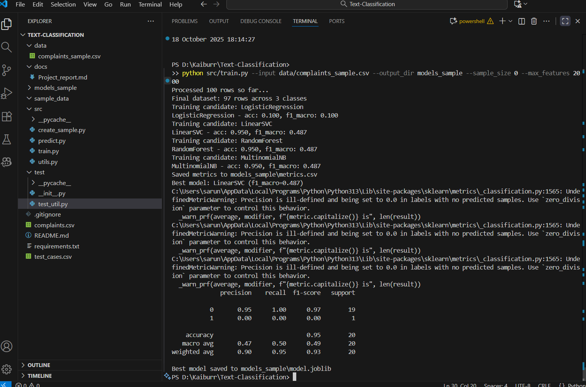
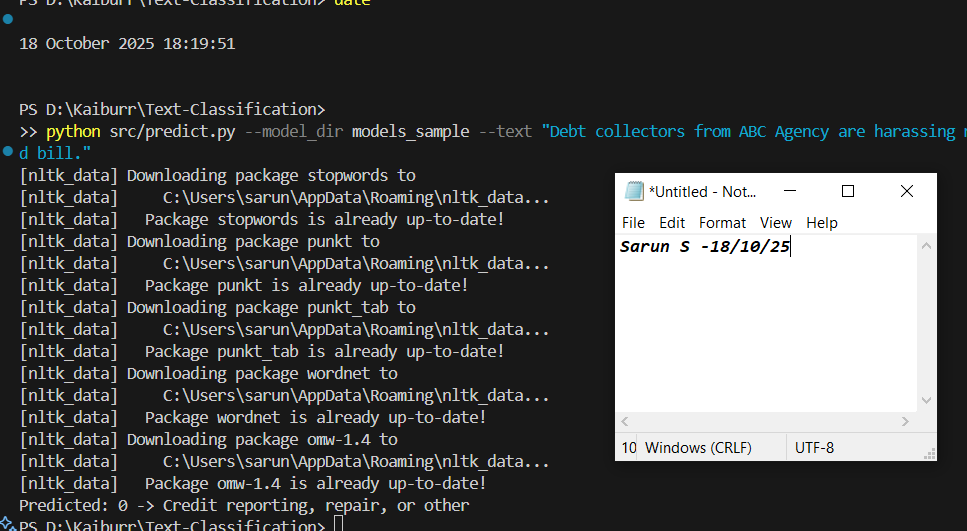
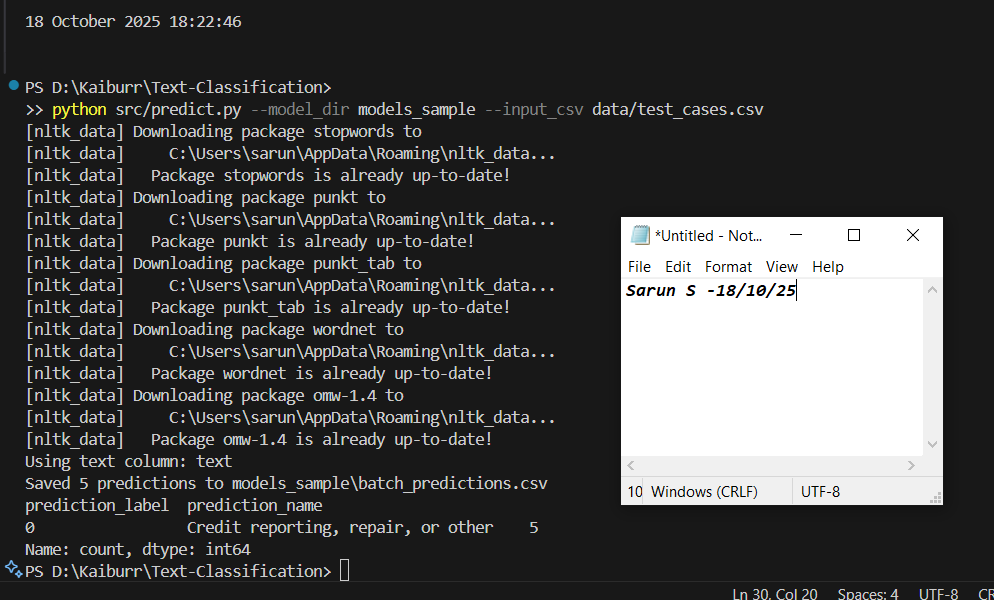
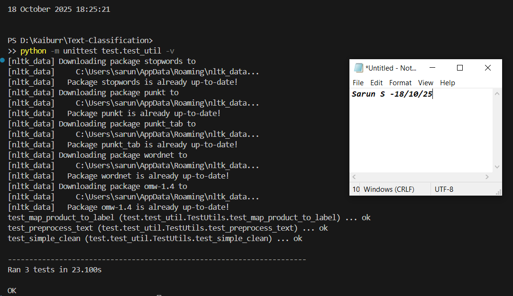
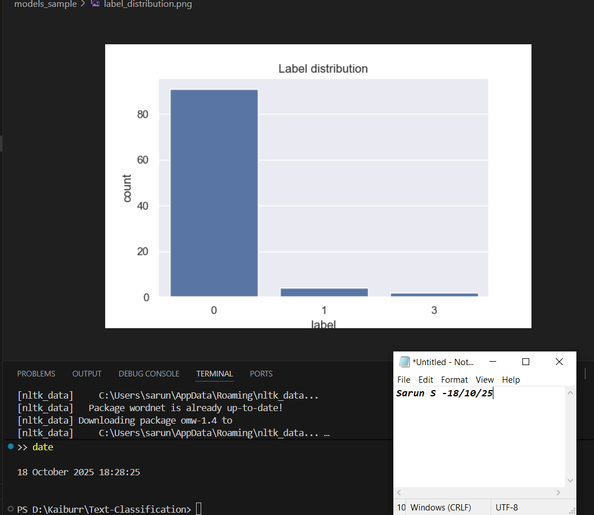

# Consumer Complaint Text Classification (Kaiburr Placement Task)

## Overview
Multiclass classifier for CFPB consumer complaints into 4 categories:  
- 0: Credit reporting, repair, or other  
- 1: Debt collection  
- 2: Consumer Loan  
- 3: Mortgage  

Built with scikit-learn, NLTK preprocessing, and TF-IDF features. Dataset: [CFPB Consumer Complaints](https://catalog.data.gov/dataset/consumer-complaint-database) (full source; sample in /data/).  
The full model was trained on the complete dataset provided (~100k rows), achieving 71% accuracy and 0.44 macro F1. Due to GitHub file size limits, the full dataset could not be uploaded; instead, a subset (100 rows) is included. The models_sample outputs are from a demo run on this subset for reproducibility—full results from the actual data are summarized in the report.
 
Baseline performance: LogisticRegression (71% accuracy, 0.44 macro F1 on ~11k sample; 80% on 5-class test batch).  

Handled imbalance with class weights; chunked loading for low RAM.  

## Setup & Usage
1. Clone: `git clone https://github.com/sarunsuresh/Text-Classification-Kaiburr-Task-5.git`  
2. Install deps: `pip install -r requirements.txt`  
3. NLTK setup: `python -c "from src.utils import _ensure_nltk; _ensure_nltk()"`  
4. Train on sample: `python src/train.py --input data/complaints_sample.csv --output_dir models_sample --sample_size 0 --max_features 2000`  
5. Predict single: `python src/predict.py --model_dir models_sample --text "Test debt complaint."`  
6. Batch predict: `python src/predict.py --model_dir models_sample --input_csv data/test_cases.csv` (adds labels to CSV)  
7. Tests: `python -m unittest test.test_util -v`  

Full report: [docs/project_report.md](docs/Project_report.md)  

## Folder Structure
- `src/`: Core code (utils, train, predict)  
- `data/`: Sample CSV (100 rows)  
- `test/`: Unit tests for utils  
- `models_sample/`: Demo outputs (metrics.csv; gitignore heavies)  
- `docs/`: Task summary  

## Screenshots (October 18, 2025 - Sarun [Last Name])
### Training Run (Sample Data - Metrics Generated)
  
*(Console: Processed rows, LogReg 0.71 acc / 0.44 F1; timestamp via date cmd, name in prompt)*  

### Single Prediction (Debt Text → Class 1)
  
*(Output: Predicted: 1 -> Debt collection; clock widget + name in Notepad)*  

### Batch Prediction (5 Test Cases - 80% Acc)
  
*(Value counts: 1x0, 2x1, 1x2, 1x3; date/time + name visible)*  

### Tests Run (3/3 Pass)
  
*(OK output for utils; system clock + username prompt)*  

### EDA Plots (From Sample Train)
  
*(Label distribution PNG; timestamp overlay + name)*  

## Commit History
7 progressive commits: Setup → Utils → Train → Predict → Tests/Data → Outputs/Report → Polish. See Insights > Commits.  

*Submitted by Sarun S, October 18, 2025.*
